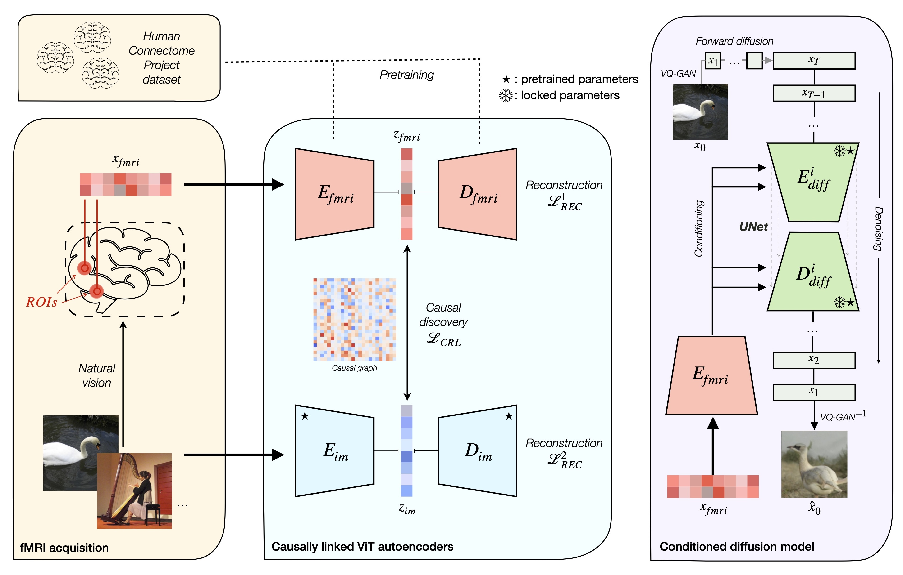

## Causally Linked AutoEncoders for fMRI data

### Abstract

*We introduce a novel framework for fMRI-based visual decoding, integrating Causal Representation Learning with Vision Transformer autoencoders. This approach can integrate multiple modalities and reveal their relationships by embedding a causal structure into the training process. Our results show that our method performs comparably to the state of the art in visual decoding using latent diffusion models, while also enhancing the interpretability potential of the models. Although we test the framework exclusively on fMRI-to-image tasks using the GOD and THINGS datasets, it can be easily adapted to other setups and modalities. This work lays the foundation for potent causal representation learning applied to complex data.*

### Method overview



### Repo structure:

**Empty folders that must be crerated / are created during training:**
- data:
    - betas_csv: THINGS data
- checkpoints: final checkpoints of the autoencoders following the double contrastive method
- pretrains: checkpoints for the pretrained latent diffusion model
- results: output folder, including training
        - tests: output folder of testing
- wandb: output of automated LDM training

**Python notebooks:**
- phase2_finetune_notebook.ipynb: contains the code to execute phase 2 of the training procedure (autoencoder training w/ causal module)
- autoencoder_testing.ipynb: test scripts for the autoencoders
- diffusion_testing.ipynb: test scripts for the LDM
- interpretation_WIP.ipynb: incomplete work on interpretation

**Code base:**
- code:
    - folders for the LDM, g-carl (causal module), the ViT
    - cross_subject_testing.py: specific script for testing AEs across subjects
    - dataset.py: creation of dataloaders
    - ldm_finetune.py: training script for the LDMs
    - phase1_pretrain_contrast.py: pretrains on the fMRI data from the Human Connectome Project
    - THINGS_load-data.py: loads and preprocesses the THINGS data
    - phase2_finetune_baseline.py: script for training the AEs without causality
    - phase2_finetune_CRL.py: script for training the AEs WITH causality

### How to use

Download the required data from below (last two links only):

- HCP: https://db.humanconnectome.org/data/projects/HCP_1200
- GOD: https://figshare.com/articles/dataset/Generic_Object_Decoding/7387130
- Preprocessed versions of GOD and BOLD5000: https://1drv.ms/u/s!AlmPyF18ti-A3Xec-3-PdsaO230u?e=ivcd7L (all credits to the [Mind-Vis team](https://github.com/zjc062/mind-vis))
- THINGS: https://plus.figshare.com/collections/THINGS-data_A_multimodal_collection_of_large-scale_datasets_for_investigating_object_representations_in_brain_and_behavior/6161151

Download the checkpoints from the double contrastive method to save time (training on HCP):
- https://1drv.ms/u/s!AlmPyF18ti-A3XmuKMPEfVNdvmsT?e=3bZ0jj (all credits to the [Mind-Vis team](https://github.com/zjc062/mind-vis))

**Use the notebook phase2_finetune_notebook.ipynb to finetune the autoencoders using the GOD or THINGS datasets.**

Then, use the script ldm_finetune.py to train a LDM. Use for example:
```
python code/ldm_finetune.py --pretrain_mbm_path INSERT_PHASE2_CKPT_PATH --num_epoch 700 --batch_size 8 --dataset GOD --lr 5.3e-5
```

Lastly, use the testing notebooks to generate results and graphs.
